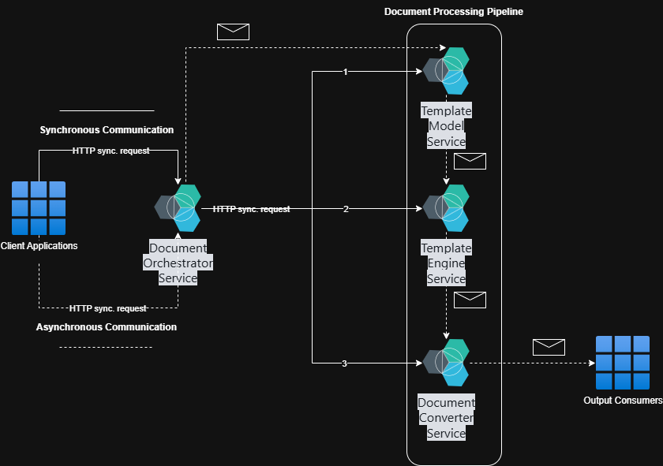

# Document Framework (Report Services 2.0)
## Overview
This repository provides a production-grade document solution designed in strict accordance with Microservices, Clean Architecture using repository pattern principles and modern enterprise application standards.

Built on .NET 10, the solution demonstrates a well-structured, scalable, and maintainable architecture for developing complex business systems. It integrates advanced document generation capabilities, AI-assisted development workflows, and specification-driven design patterns, enabling teams to accelerate development while preserving architectural consistency and code quality.

The solution is intended to serve both as a reference implementation for Clean Architecture best practices and as a ready-to-use foundation for enterprise-level applications that require long-term maintainability, extensibility, and high development efficiency.

## Key Features
- **PDF Generator:** PDF generation using HTML and CSS
- **Templating Engine:** Razor syntax
- **Template Combination:** Two or more templates combination
- **Multiple Data Sources:** Using JSON, XML
- **Template Version:** Template versioning and active duration

## Key Designs
- **Microservices Architecture:** Small, loosely coupled, and independently deployable services
- **Clean Architecture Using Repository Pattern:** Layer separation with dependency inversion in each service
- **Modern UI:** Beautiful, responsive interface built with ASP.NET Core Blazor and Fluent UI Blazor
- **Real-time Communication:** SignalR integration for live updates
- **Enterprise Security:** Multi-factor authentication, role-based access control
- **Advanced Data Grid:** Sorting, filtering, pagination, and export capabilities
- **Docker Ready:** Complete containerization support

## Clean Architecture Layer Responsibilities
- **Application Core:** Core business entities and rules (no dependencies), business logic, interfaces, and DTOs
- **Infrastructure:** External concerns (database, email, file system)
- **HTTP API & Web UI:** HTTP APIs, Blazor components and user interface

## Architecture Overview

### Services
1. Document Orchestrator Service
   - The facade service for the Document Framework
2. Template Model Service
   - Map data from data source and create a model for the specified template in JSON format output
3. Template Engine Service
   - Render HTML from Razor markup in the template
4. Document Converter Service
   - Convert HTML to PDF document
5. ...

## Technology Stack
| Layer | Technologies |
|-------|--------------|
| Frontend | ASP.NET Core Blazor, Fluent UI Blazor v5, SignalR |
| Backend | .NET 10, ASP.NET Core HTTP API |
| Database | Entity Framework Core, MSSQL/PostgreSQL |
| Authentication | ASP.NET Core Identity, OAuth 2.0, JWT |
| Background Processing | Hosted services, in-memory queues |
| Testing | xUnit, FluentAssertions, Moq |
| DevOps | Docker |

## Prerequisites
- [.NET 10 SDK](https://dotnet.microsoft.com/en-us/download/dotnet/10.0)
- [Visual Studio 2026](https://visualstudio.microsoft.com) or [Rider](https://www.jetbrains.com/rider) or [Visual Studio Code](https://code.visualstudio.com)
- [Docker Desktop](https://www.docker.com) (optional)

## Database Support
| Database | Provider Name | Status |
|----------|---------------|--------|
| SQL Server | mssql | Fully Supported |
| PostgreSQL | postgresql | Fully Supported |
